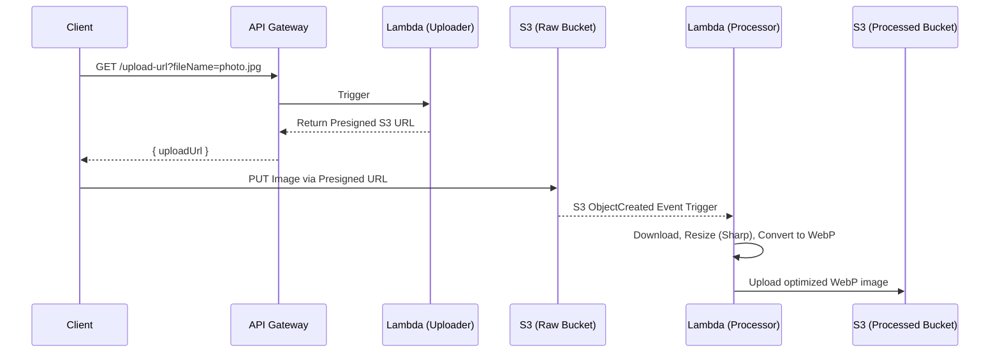

# Serverless Image Processing API

Hey! Welcome to my Serverless Image Processing API project. I built this to experiment with AWS serverless architecture and see how effectively I could solve the common problem of handling media uploads at scale.

## Architecture Overview

I decided to use the **Serverless Framework** with **Node.js** to handle the infrastructure. One of the main challenges with image uploads is hitting API Gateway payload limits. To get around this, I implemented a pattern using **S3 Presigned URLs**. This allows clients to upload their images directly to S3 without passing the file through the API routing layer, which saves both time and cost.

Here's a breakdown of the flow I built:



## Tech Stack I Used

- **Framework**: [Serverless Framework](https://www.serverless.com/)
- **Runtime**: Node.js 20.x
- **Image Processing**: [Sharp](https://sharp.pixelplumbing.com/) (super fast!)
- **AWS Services**:
  - **AWS Lambda**
  - **Amazon S3**
  - **Amazon API Gateway**

## Getting Started

If you want to run this yourself or check out the code:

### Prerequisites
Make sure you have Node.js installed, an AWS account, and your local AWS credentials configured (`aws configure`).

### Setup

1. **Clone the repo:**
   ```bash
   git clone https://github.com/YOUR_GITHUB/serverless-image-api.git
   cd serverless-image-api
   ```

2. **Install the packages:**
   ```bash
   npm install
   ```

3. **Deploy to your AWS account:**
   ```bash
   npx serverless deploy
   ```
   *(Keep an eye out for the API Gateway endpoint URL that gets printed at the end of the deployment.)*

### How to use the API

1. **Get an upload URL:**
   ```bash
   curl "https://<YOUR_API_ID>.execute-api.us-east-1.amazonaws.com/upload-url?fileName=my-pic.jpg&contentType=image/jpeg"
   ```

2. **Upload your image directly to the provided S3 URL:**
   ```bash
   curl -X PUT -T ./local-image.jpg -H "Content-Type: image/jpeg" "<UPLOAD_URL_FROM_PREVIOUS_STEP>"
   ```

3. **See the result:**
   In the background, the processor Lambda will automatically catch the event, resize the image, convert it to `.webp`, and save it to the Processed S3 Bucket.

Hope you find this approach useful! Feel free to fork or open an issue if you see any room for improvement.

## License
MIT License.
